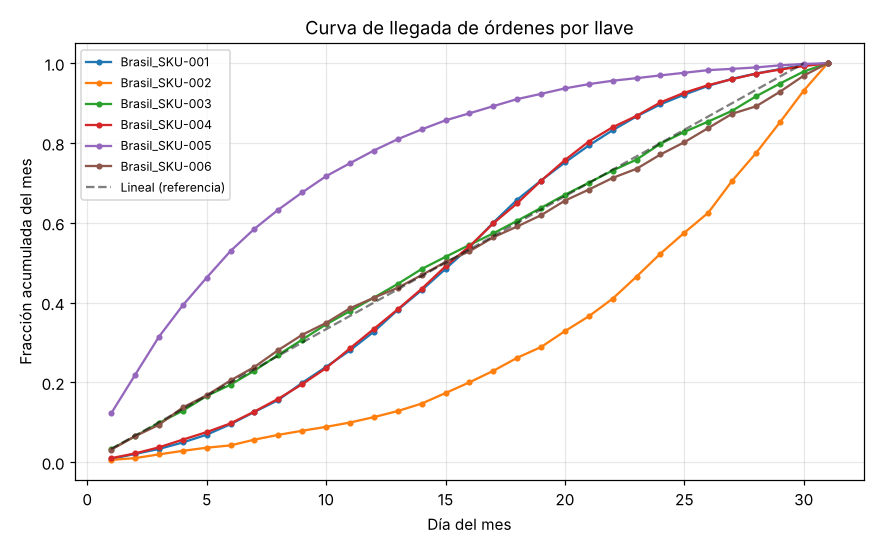
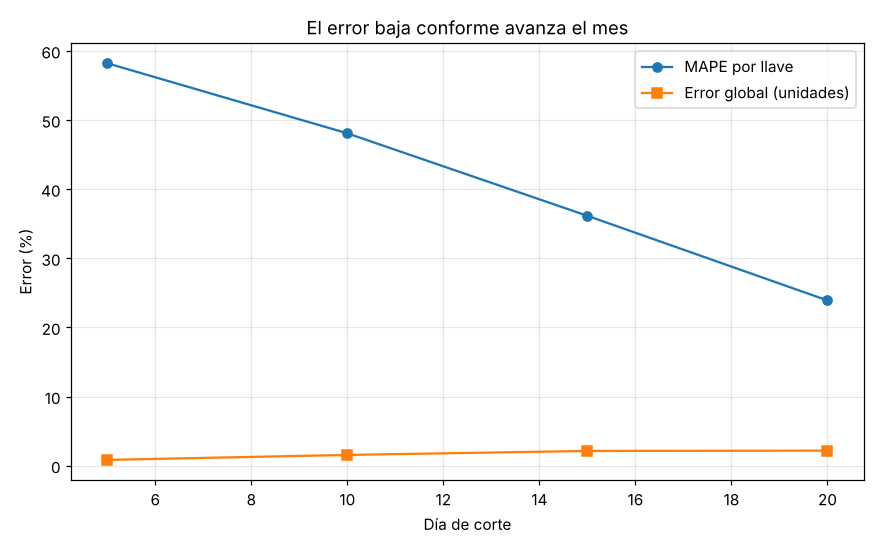

# Estimación de cierre de demanda

Este proyecto salió de un problema que me tocó resolver en el trabajo: estar a mitad
de mes y tener que responder *"¿en cuánto vamos a cerrar la demanda de cada producto?"*
antes de que el mes termine. Lo armé de nuevo desde cero, con datos inventados, para
poder enseñarlo.

La idea no es adivinar el futuro con un modelo complicado, sino usar algo que ya está
ahí: **los pedidos no llegan parejos durante el mes**. Hay productos que se piden casi
todos a inicio de mes y otros que cargan al final. Si conozco ese patrón, puedo mirar
lo que llevo hoy y proyectar en cuánto va a cerrar.

## El problema, más concreto

Supongamos que es día 12 de un mes de 30. Para cada combinación de país y producto
(le digo "llave") tengo dos cosas:

- las **órdenes que ya llevo confirmadas** este mes, y
- el **forecast** de todo el mes (lo que esperábamos vender).

Lo fácil sería suponer que lo que falta llega de forma pareja: si voy en el día 12 de
30, debería llevar el 40%. Pero eso casi nunca se cumple. Por eso en vez del supuesto
lineal uso la historia.

## Cómo funciona

**1. Armo una curva de llegada con la historia.**
Con 3 meses pasados, para cada llave calculo qué fracción del total del mes llegó cada
día, y la acumulo. Eso me da una curva: "a estas alturas del mes normalmente ya cayó
tanto por ciento". La diferencia entre esa curva y una recta es justo lo que el
supuesto lineal se pierde:



**2. Miro el avance real del mes en curso.**
Cuántas unidades llevo contra el forecast.

**3. Proyecto el cierre.**
A lo que ya llevo le sumo lo que, según la curva histórica, todavía falta por llegar:

```
cierre estimado (%) = avance actual (%) + (1 − fracción que ya debería haber pasado)
```

**4. Semáforo.**
Para que sea accionable, marco cada llave: arriba de 120% del forecast es **sobre
demanda** (riesgo de quedarme corto), abajo de 80% es **baja demanda** (riesgo de
sobrestock), y en medio queda **en rango**.

## ¿Qué tan bien funciona?

Como los datos son simulados, tengo el cierre real del mes (que en la vida real no
conocería todavía) y lo puedo usar para medir el error. Me paro en distintos días de
corte, proyecto, y comparo contra lo que de verdad cerró:



| Día de corte | MAPE por llave | Error global (unidades) |
|:---:|:---:|:---:|
| 5  | 58% | 0.8% |
| 10 | 48% | 1.6% |
| 15 | 36% | 2.1% |
| 20 | 24% | 2.2% |

Dos lecturas:

- **En agregado funciona muy bien.** El error sobre el total de unidades se queda en
  1–2% casi todo el mes. Para planear compras a nivel país o región, el número es
  confiable desde temprano.
- **Por SKU individual arranca flojo y mejora.** El MAPE por llave empieza alto porque
  los productos chicos son ruidosos, y baja a la mitad conforme avanza el mes y hay más
  órdenes confirmadas. Tiene sentido: entre más del mes ya pasó, menos estoy proyectando
  y más estoy contando.

## Limitaciones (lo que sé que le falta)

- **El supuesto grande:** el modelo lee "avance alto" como "va a cerrar alto". Pero si
  un cliente simplemente *adelantó* sus compras, va a cerrar igual que siempre y el
  modelo lo marca como sobre demanda sin que lo sea. Distinguir *más demanda* de
  *demanda adelantada* es lo siguiente que me gustaría meterle (por ejemplo, mirando el
  historial de ese cliente).
- La curva histórica son solo 3 meses. Con más meses, y separando por temporada,
  debería quedar más estable.
- Las llaves sin historia caen a un supuesto lineal. Son las menos confiables y el
  código las marca aparte para revisarlas a mano.

## Cómo correrlo

```bash
pip install -r requirements.txt

python src/generar_datos.py    # crea los datos sintéticos en data/
python src/modelo_cierre.py    # corre la estimación y la imprime
python src/backtest.py         # mide el error contra el cierre real
```

O abrir `notebook.ipynb`, que es lo mismo pero explicado paso a paso y con las gráficas.

## Estructura

```
.
├─ README.md
├─ requirements.txt
├─ notebook.ipynb          # versión explicada paso a paso
├─ src/
│  ├─ generar_datos.py     # genera las órdenes y el forecast inventados
│  ├─ modelo_cierre.py     # la estimación de cierre + semáforo
│  └─ backtest.py          # validación contra el cierre real
├─ data/                   # datos generados (no se versionan)
└─ img/                    # gráficas del README
```

## Una nota sobre los datos

Todos los datos de este repo son **inventados**: los genera `src/generar_datos.py` con
países y productos genéricos (`SKU-001`, etc.). La metodología es la misma que usaría
con datos reales, pero aquí no hay nada que venga de ninguna empresa.
